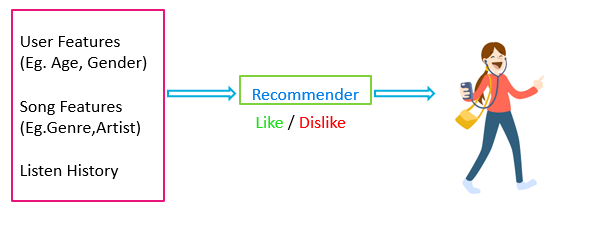
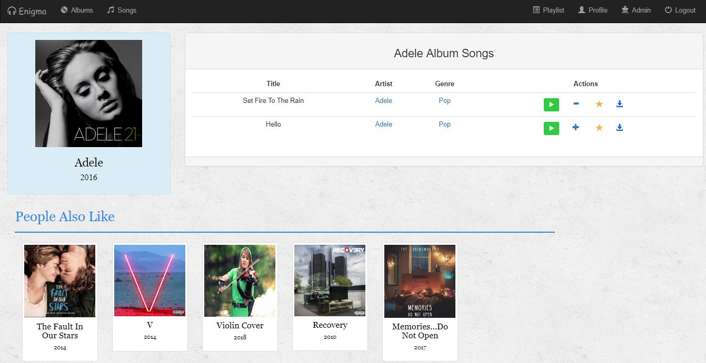
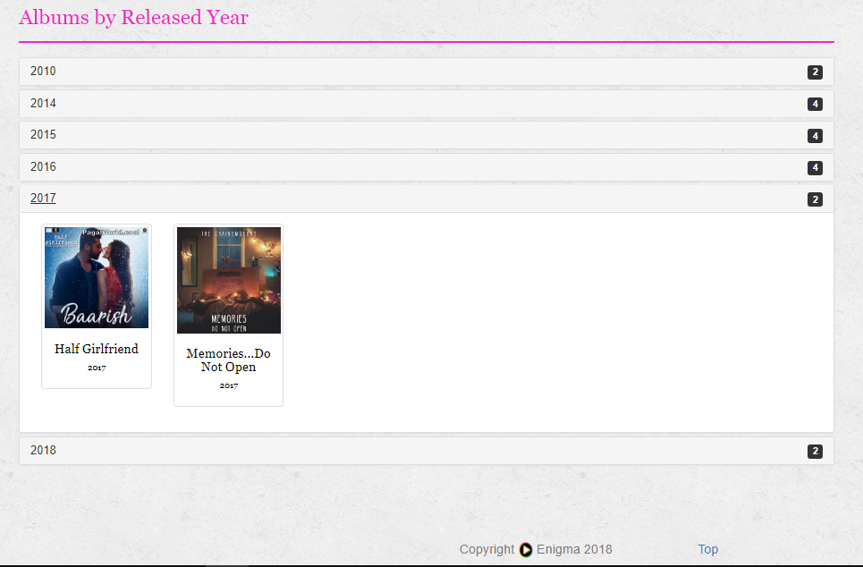
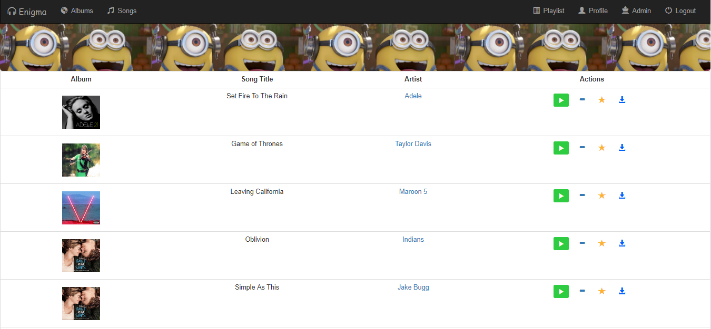
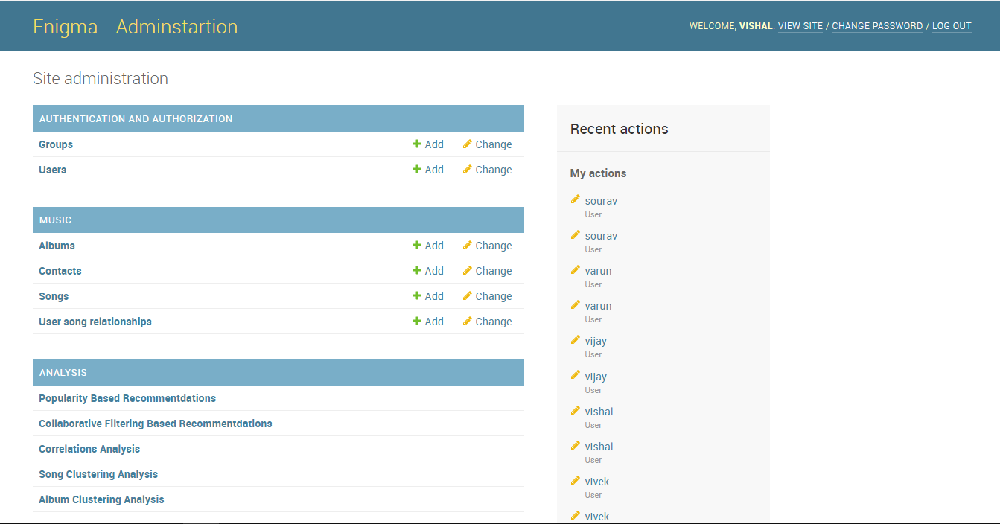

[](http://musicrecommender.pythonanywhere.com/)

# What is [Enigma](http://musicrecommender.pythonanywhere.com/)
Enigma is an <b>Music Recomedation System</b> that provide Personalized Recommendations to the users.


## How does it work?
It make use of various type of Recommender Algorithms such as
<ol>
 <li>Popularity Based Recommendations
<li>Collaborative Filtering Based Recommendations
<li>Content Based Recommendations




## Songs
User can performs various actions on a song such as : <text style="font-size: 20px;color: #449d44">Play </text> <text style="font-size: 18px;color: #337ab7">Add to Playlist </text> <text style="font-size: 20px;color: #FDB230">Favorite </text> <text style="font-size: 18px;color: #23527c">Download </text>


## Albums




## Playlist

You can add/remove songs to the playlist using <b style="font-size: 25px;color: blue">+ </b> / <b style="font-size: 30px;color: blue">-</b> buttons.




## Searching

You can also search for music using the search feature provided in the home page. Which make use of AJAX to provide responsive
search results. 


## Admin Panel
 
Enigma provides interactive admin panel to visualize and update the database.




## Shared Account
 
Enigma provides facility to login for user without creating account through a Shared Account<br>In order to login through Shared Account user has to click on Login as <b style="color: red">Testuser</b>.


## Modules Used

    Python Version : 3.5.1

```
Django==2.0.2
lazy-object-proxy==1.3.1
matplotlib==2.1.2
numpy==1.14.2
pandas==0.22.0
Pillow==5.0.0
scikit-learn==0.19.1
scipy==1.0.0
seaborn==0.8.1
sklearn==0.0
```


To install all the dependencies please do:

    pip install -r requirements.txt